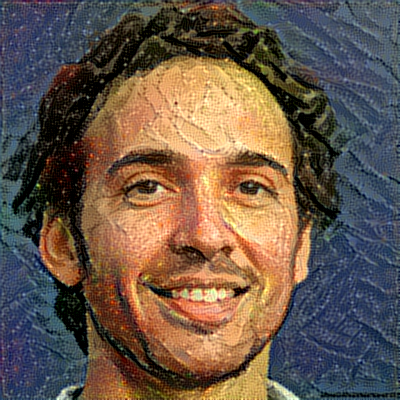

# Deep Art Gallery

Dieses Projekt ermöglicht es, Bilder mit neuronalen Netzwerken in verschiedene künstlerische Stile zu transformieren und
die Ergebnisse in einer Galerie darzustellen. Um dein eigenes Ergebnis hinzuzufügen, folge den untenstehenden Schritten.

* [Link zur Gallery](https://yodarx.github.io/deep_art_gallery/)
* [Link zum Colab](https://colab.research.google.com/github/yodarx/deep_art_gallery/blob/main/deep_art_gallery.ipynb)

## Schritte zum Hinzufügen eines Ergebnisses zur Galerie

1. Repository auschecken

    ```
    git clone https://github.com/yodarx/deep_art_gallery.git
    cd deep_art_gallery
    ```

1. Neuen Branch erstellen
    ```
    git checkout -b juergs_deep_art
    ```
1. Input-Bild sichern

    * Speichere das Input-Bild (das Originalbild) im Verzeichnis `/data/input`.

1. Gewünschtes Style-Bild für den Transfer sichern

    * Speichere das gewünschte Style-Bild (z. B. ein Picasso-Gemälde) im Verzeichnis `/data/style`.

1. Ergebnis-Bild generieren oder sichern

    * Wenn du bereits ein generiertes Bild hast, speichere es im Verzeichnis `/data/output`.

    * Alternativ kannst du das Bild auch mit dem Jupyter-Notebook `deep_art_gallery.ipynb` generieren. Es wird
      empfohlen, das
      Notebook
      in [Google Colab](https://colab.research.google.com/github/yodarx/deep_art_gallery/blob/main/deep_art_gallery.ipynb)
      mit T4-Ressourcen auszuführen, um schnell, die besten Ergebnisse zu erzielen.

1. Bild in Gallery hinzufügen

    * Füge den folgenden Codeblock in die Datei index.html ein, um dein Ergebnis in die Galerie aufzunehmen.
      Platziere den Code über dem Kommentar:
   ```
   <!--  Add your images -->
   ```

* Füge dann diesen Codeblock hinzu und referenziere deine Bilder in `openLightBox(..)` und im `<div class = imges>`:

   ```
    <figure onclick="openLightbox('Comparison 1: Picasso Style Transformation with 2000 Iterations by Jeremy Rhodes',
     './data/input/not_jeremy.png',
     './data/output/not_jeremy_picasso_self_portrait.png',
     './data/styles/picasso_self_portrait.png')">
        <div class="images">
            
            
            
        </div>
        <figcaption>Comparison 1: Picasso Style Transformation with 2000 Iterations by Jeremy Rhodes</figcaption>
    </figure> 
   ```

1. Änderungen committen und pushen
1. Erstelle einen Pull Request um deine Änderungen in den main-Branch zu integrieren und dein Ergebniss in der Gallery
   zu sehen.